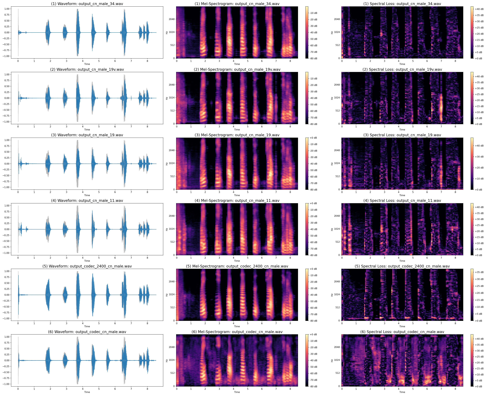

It shows the speech effect of different compressed bit rates of AudioDec for 128Kbps PCM stream. The results can be seen at [https://chengbin-liang.github.io/Audio-Encodec/](https://chengbin-liang.github.io/Audio-Encodec/)

